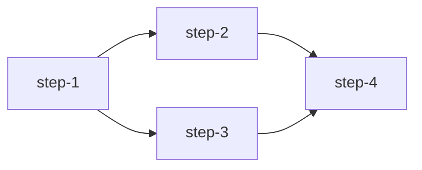

# Workflow Specification Template

## Metadata

| Field | Value |
|-------|-------|
| **Name** | `{{name}}` |
| **Version** | `{{version}}` |
| **Created** | `{{created_date}}` |
| **Author** | `{{author}}` |
| **Status** | `{{draft/review/approved/deprecated}}` |

## Overview

### Purpose
Describe what this workflow accomplishes in 2-3 sentences.

### Domain
`{{physics | defi/web3 | meme-content | full-stack-planning | research-beast | code-review | other}}`

### Complexity
`{{1-10}}` (1 = simple, 10 = extremely complex)

### Estimated Time
`{{time_range}}` (e.g., "5-15 minutes", "1-2 hours")

## Workflow Definition

```yaml
# See workflows/ directory for actual YAML
```

## Input Specification

### Required Inputs
| Input | Type | Required | Description |
|-------|------|----------|-------------|
| `{{input_name}}` | `string` | Yes/No | Description |

### Optional Inputs
| Input | Type | Default | Description |
|-------|------|---------|-------------|
| `{{input_name}}` | `string` | `default` | Description |

### Example Input
```json
{
  "example": "input data"
}
```

## Output Specification

### Outputs
| Output | Type | Description |
|--------|------|-------------|
| `{{output_name}}` | `type` | Description |

### Example Output
```json
{
  "example": "output data"
}
```

## Step-by-Step Breakdown

### Step 1: `{{step_name}}`
- **Type**: `{{thought/action/reflection}}`
- **Agent**: `{{agent_name}}`
- **Description**: What this step does
- **Inputs**: What it receives
- **Outputs**: What it produces
- **Timeout**: `{{time}}`

### Step 2: `{{step_name}}`
...

## Dependencies

### Step Dependencies


### Parallel Execution
Which steps can run in parallel:
- `step-2` and `step-3` are independent

## Guardrails

### Safety Rules
- `{{rule_1}}`
- `{{rule_2}}`

### Constraints
- `{{constraint_1}}`
- `{{constraint_2}}`

### Prohibited Actions
- `{{prohibited_action_1}}`
- `{{prohibited_action_2}}`

## Success Criteria

### Must Have
- [ ] `{{criterion_1}}`
- [ ] `{{criterion_2}}`

### Should Have
- [ ] `{{criterion_1}}`
- [ ] `{{criterion_2}}`

### Nice to Have
- [ ] `{{criterion_1}}`
- [ ] `{{criterion_2}}`

## Error Handling

### Retry Policy
- Max attempts: `{{number}}`
- Backoff strategy: `{{linear/exponential}}`
- Conditions for retry: `{{when}}`

### Fallback Strategies
1. `{{fallback_1}}`
2. `{{fallback_2}}`
3. `{{fallback_3}}`

### Escalation Conditions
- When to involve human:
  - `{{condition_1}}`
  - `{{condition_2}}`

## Examples

### Example 1: Basic Usage
**Input**:
```json
{
  "input": "value"
}
```

**Execution Trace**:
1. `step-1`: Result description
2. `step-2`: Result description
3. `step-3`: Result description

**Output**:
```json
{
  "result": "value"
}
```

### Example 2: Edge Case
**Input**:
```json
{
  "input": "edge_case_value"
}
```

**Expected Behavior**:
Description of how edge case is handled

## Integration Points

### Required Skills/Agents
- `{{skill/agent_1}}`
- `{{skill/agent_2}}`

### External Dependencies
- `{{dependency_1}}`
- `{{dependency_2}}`

### Related Workflows
- `{{workflow_1}}` - How it relates
- `{{workflow_2}}` - How it relates

## Performance Considerations

### Estimated Token Usage
- Average: `{{number}}` tokens
- Maximum: `{{number}}` tokens

### Estimated Cost
- Approximate cost: `${{amount}}`

### Optimization Tips
- `{{tip_1}}`
- `{{tip_2}}`

## Testing

### Unit Tests
- `{{test_file_1}}`
- `{{test_file_2}}`

### Integration Tests
- `{{test_name}}`: `{{description}}`

### Test Coverage
- Current coverage: `{{percentage}}%`
- Target coverage: `{{percentage}}%`

## Version History

| Version | Date | Changes | Author |
|---------|------|---------|--------|
| 1.0.0 | YYYY-MM-DD | Initial version | `{{author}}` |
| 1.1.0 | YYYY-MM-DD | `{{changes}}` | `{{author}}` |

## Notes

### Limitations
- `{{limitation_1}}`
- `{{limitation_2}}`

### Future Enhancements
- `{{enhancement_1}}`
- `{{enhancement_2}}`

### Known Issues
- `{{issue_1}}`: Workaround `{{workaround}}`
- `{{issue_2}}`: Workaround `{{workaround}}`

## References

### Related Documentation
- [Link to architecture](architecture.md)
- [Link to best practices](best-practices.md)
- [Link to skills repo](../Awesome-Grok-Skills/)

### External Resources
- [Link to relevant documentation](url)
- [Link to research paper](url)
- [Link to tool documentation](url)
